# Spectrogram Lab

[](LICENSE)
[](#2-run-it)
[](#6-architecture)
[](tests/verify_pro.js)
[](#6-architecture)

A real-time audio spectrogram and DSP workbench that runs entirely in the
browser. Drop in an `.mp3` or `.wav` and explore it through **a dozen
time–frequency representations**, a five-band **parametric EQ**, a **spectral
"paint brush"** editor with ISTFT resynthesis, harmonic–percussive separation,
loudness/true-peak metering, and automatic anomaly scanning — all with a
synchronized playhead and **no build step**.

<p align="center">
  
</p>

> Zero dependencies. Zero telemetry. Zero server. Open `index.html` behind any
> static HTTP server and you have a miniature DSP lab in your browser.

### See it in action

<table>
  <tr>
    <td align="center" width="25%">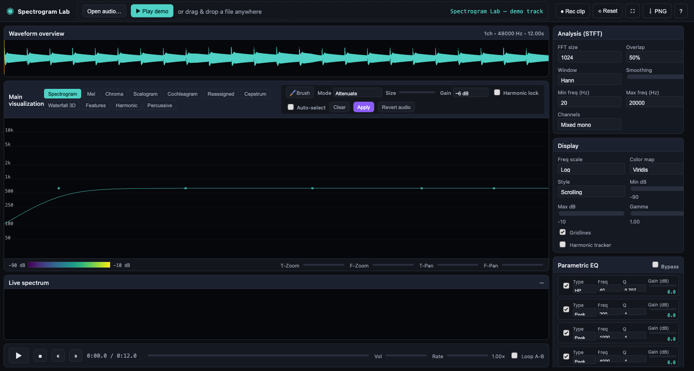<br/><sub><b>Scrolling spectrogram</b><br/>synchronized to playback</sub></td>
    <td align="center" width="25%">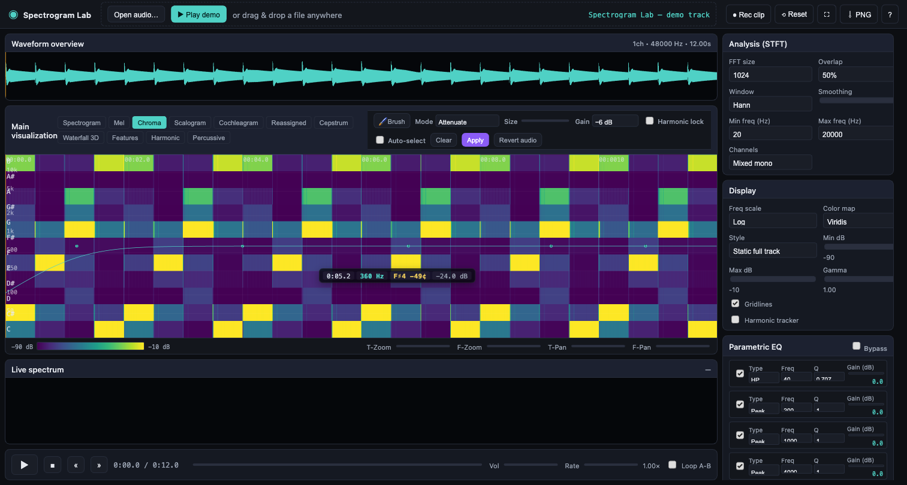<br/><sub><b>11 time-frequency views</b><br/>switch live</sub></td>
    <td align="center" width="25%"><br/><sub><b>Spectral brush + ISTFT</b><br/>paint to edit audio</sub></td>
    <td align="center" width="25%">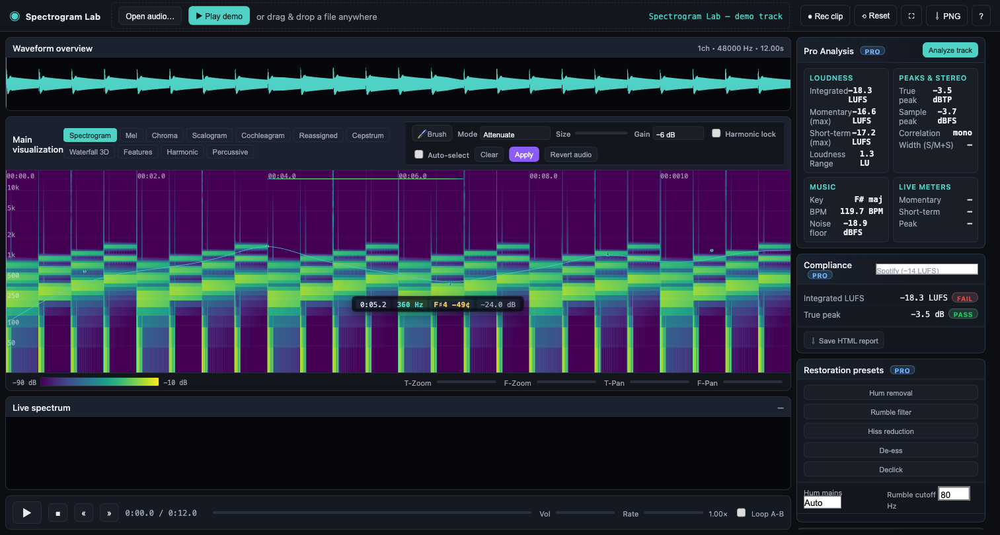<br/><sub><b>LUFS, true peak, key,<br/>BPM, anomaly scan</b></sub></td>
  </tr>
</table>

---

## 1. Contents

1. [Run it & Quick tour](#2-run-it)
2. [Screenshot gallery](#3-screenshot-gallery)
3. [Features at a glance](#4-features-at-a-glance)
4. [Pro features](#5-pro-features)
5. [Keyboard shortcuts](#6-keyboard-shortcuts)
6. [Architecture](#7-architecture)
7. [Action graph — what happens at each step](#8-action-graph--what-happens-at-each-step)
8. [Expected behaviour per feature](#9-expected-behaviour-per-feature)
9. [Known limitations](#10-known-limitations)
10. [Tests](#11-tests)
11. [Contributing](#12-contributing)
12. [License](#13-license)

---

## 2. Run it

There is **no build step** — but the analysis runs inside a classic Web
Worker that uses `importScripts`, which browsers refuse to load over
`file://`. Serve the folder with any static HTTP server:

```bash
# Clone
git clone https://github.com/victordov/music-spectrogram.git
cd music-spectrogram

# Serve (pick one)
npm start                         # alias for python3 -m http.server 5173
python3 -m http.server 5173       # stdlib; no deps
npx http-server -p 5173           # Node, no install
php -S localhost:5173             # also works
```

Then open <http://localhost:5173> in a recent **Chrome 90+**, **Firefox 90+**,
or **Safari 15+**. Drag a file onto the page, or click *Play demo* for a
zero-click tour.

### Quick tour

**① Start from the empty state.** Drop an `.mp3`/`.wav` onto the page, click
*Open audio file…*, or hit *Play demo track* for a 12-second synthetic
reference (tones, arpeggios, broadband crackle, ultrasonic pilot — enough to
exercise every view and detector).

<p align="center">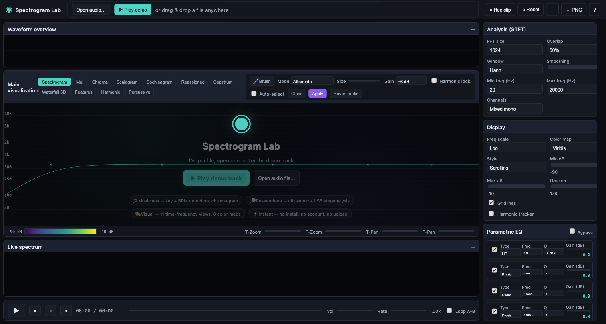</p>

**② Press Space to play.** The waveform overview, static spectrogram, live
frequency bars, and playhead cursor all stay synchronized with the audio
clock (sample-accurate — playback time is derived from
`AudioContext.currentTime`, not rAF).

<p align="center">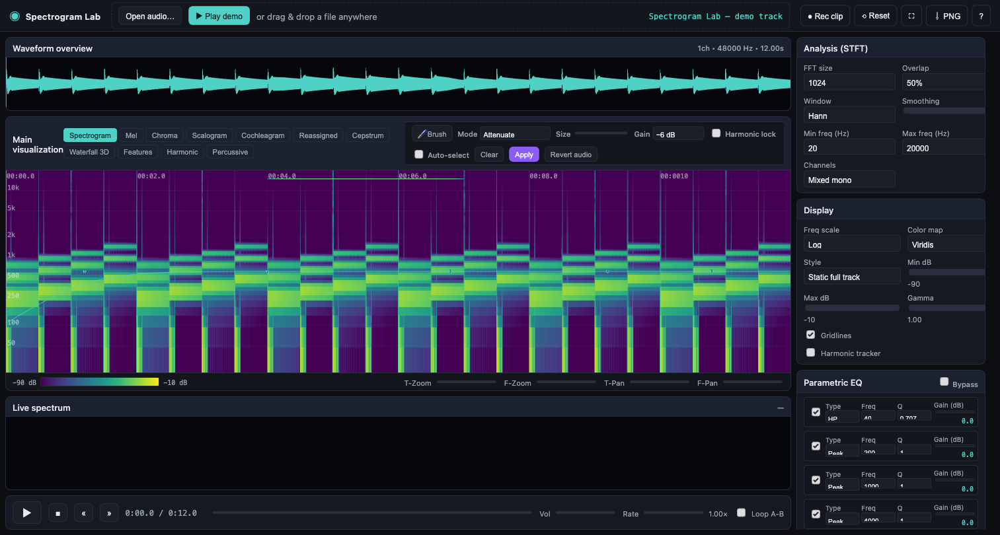</p>

**③ Switch visualisation live.** Use the top toolbar to jump between
*Spectrogram / Mel / Chroma / Scalogram / Cochleagram / Reassigned / Cepstrum
/ Waterfall 3D / Features / Harmonic / Percussive* — no reload, caches are
reused.

<p align="center">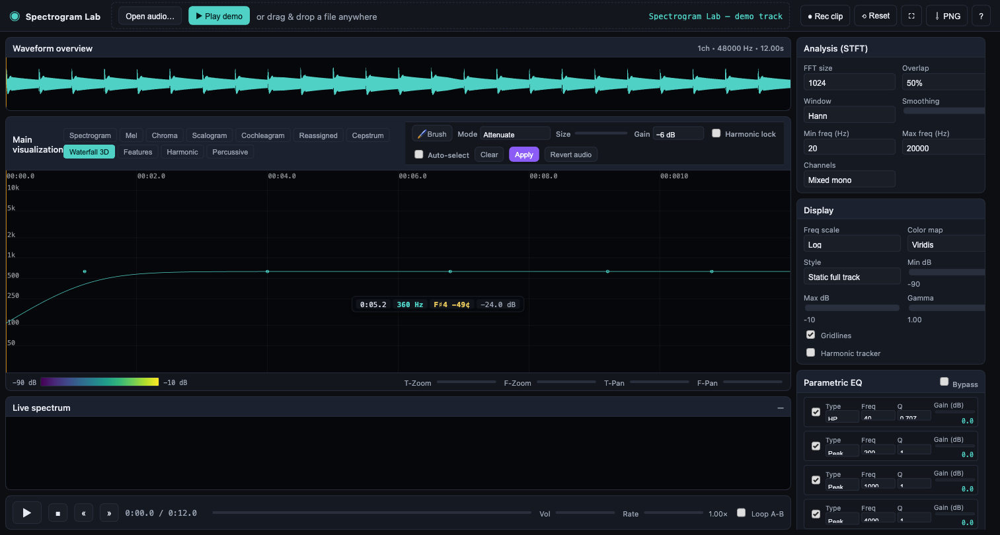</p>

**④ Edit audio by painting.** Enable *Brush*, drag across the spectrogram to
attenuate (red), amplify (green), or smooth (cyan), then hit *Apply* to
resynthesise via ISTFT — the edited audio replaces the playing buffer.

<p align="center"></p>

**⑤ Shape the sound with the 5-band EQ.** Flip on the cyan response curve to
see what the filter chain is doing to your spectrum in real time.

<p align="center">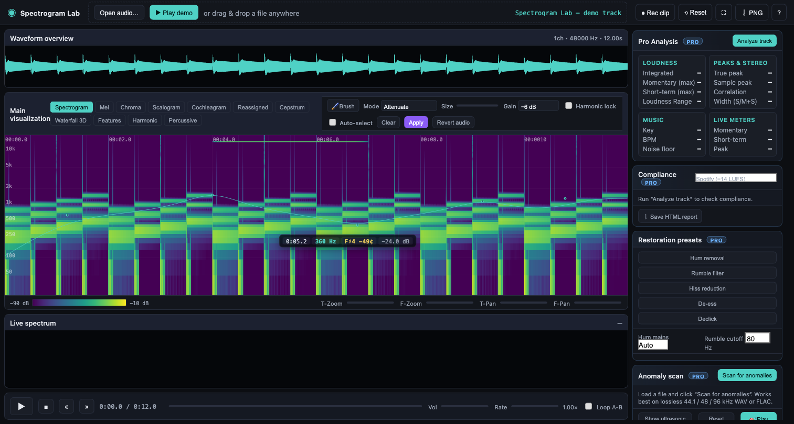</p>

**⑥ Run the Pro analysis pass.** One click produces integrated LUFS, true-peak
dBTP, stereo correlation, detected key, tempo, and a nine-target compliance
report (Spotify, Apple Music, YouTube, Tidal, EBU R128, ATSC A/85, ACX, …).

<p align="center"></p>

**⑦ Hunt anomalies automatically.** The scanner reports ultrasonic content,
sustained pilot tones, broadband bursts, LSB steganalysis, and geometric
hotspots. Press *🎯 Play hunt* to auto-seek to each hotspot in turn.

<p align="center">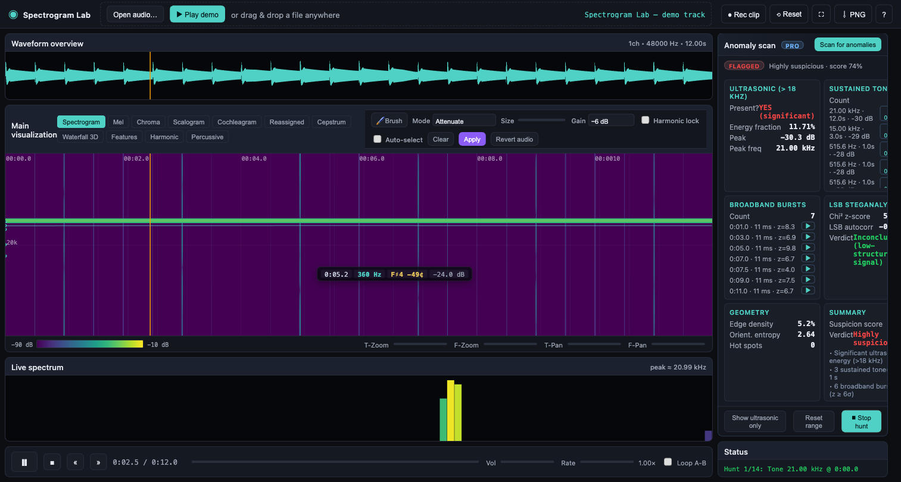</p>

Hover the spectrogram any time to see the time, frequency, nearest musical
note (with cents deviation), and dB at the cursor:

<p align="center">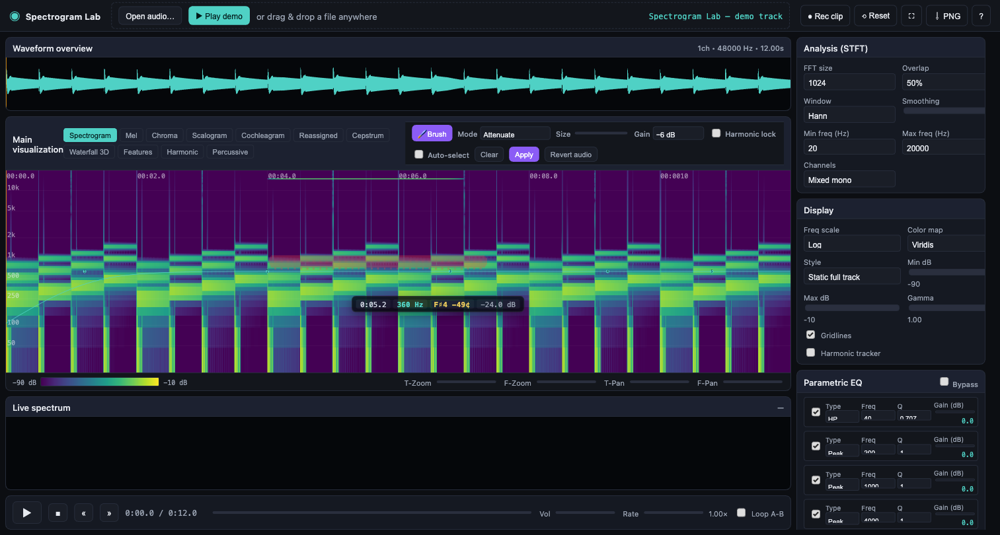</p>

See [§6 Keyboard shortcuts](#6-keyboard-shortcuts) for the full hotkey list.

---

## 3. Screenshot gallery

A focused tour lives in [§2 Quick tour](#quick-tour) above. The full set of
reference screenshots is in [`docs/screenshots/`](docs/screenshots/). The
grids below show the alternative visualisation modes side-by-side so you can
compare at a glance.

### Time–frequency views

| Scrolling spectrogram | Static full-track | Waterfall / 3D |
| :---: | :---: | :---: |
|  |  |  |

| Mel spectrogram | Chromagram | Wavelet scalogram |
| :---: | :---: | :---: |
| 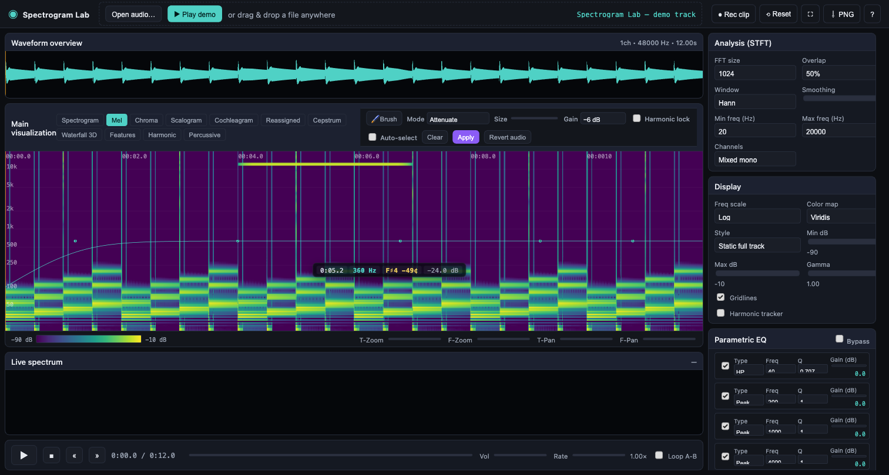 |  | 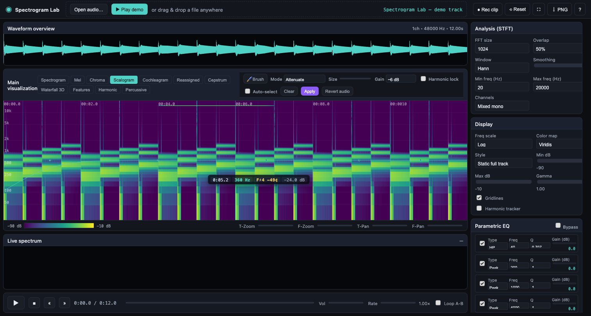 |

| Cochleagram | Spectral features | Hover readout |
| :---: | :---: | :---: |
| 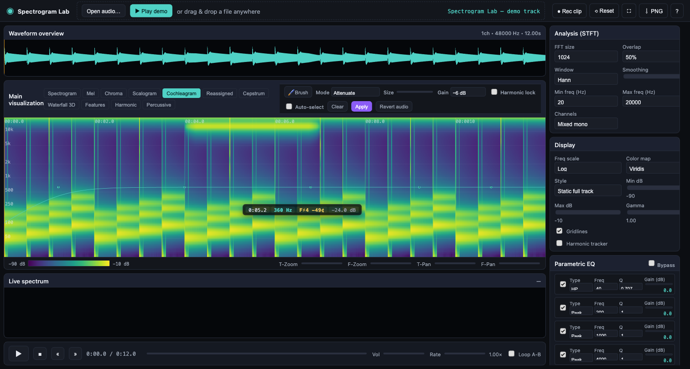 | 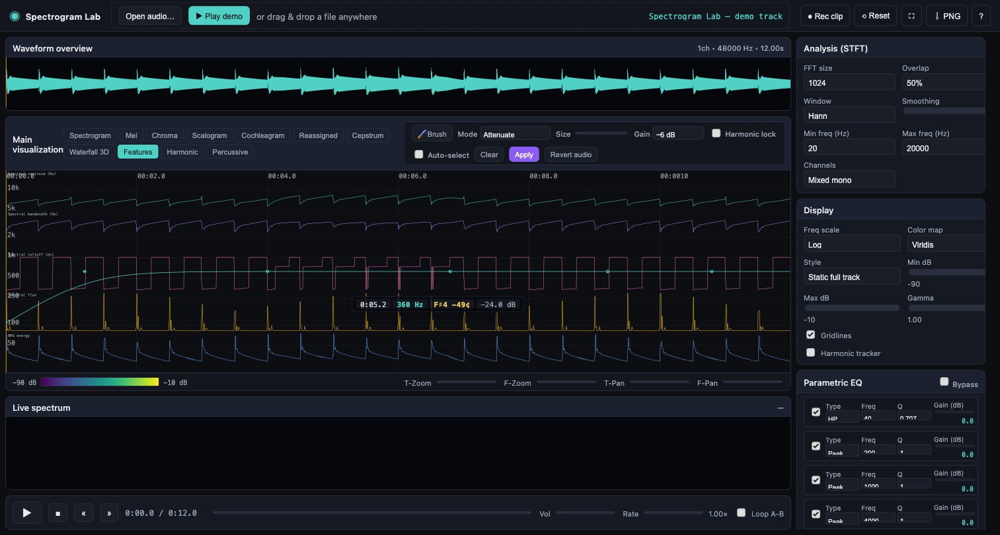 |  |

---

## 4. Features at a glance

### Playback
Drag-and-drop or file-picker import (`.mp3`, `.wav`; also `m4a/ogg/flac` if the
browser can decode them), play/pause/resume/stop, accurate seek, scrub,
waveform overview with click-to-seek, timeline with current/total duration,
volume, playback-rate (0.25×–2×), and A–B loop.

### Time–frequency views (switchable live)
Scrolling spectrogram, static full-track spectrogram with moving cursor,
waterfall/pseudo-3D spectrogram, mel spectrogram, chromagram (12 pitch
classes), complex-Morlet wavelet scalogram, gammatone cochleagram,
reassigned-style sharpened spectrogram, cepstrum (quefrency) plot, spectral
feature panel (centroid / bandwidth / rolloff / flux / RMS), live frequency
bars, HPS-harmonic-only view, HPS-percussive-only view.

### DSP controls
FFT size (256 → 8192), overlap (25/50/75/87.5 %), window function (Hann,
Hamming, Blackman, Bartlett, Rectangular, Flat-Top), smoothing, min/max
displayed frequency, channel mode (mixed/L/R/stereo), linear/log freq axis,
eight colour maps, min/max dB, gamma, time and frequency zoom/pan.

The **min / max displayed frequency** controls are also a hard band-limit on
the *audio path*: a 4th-order Linkwitz-Riley filter (cascaded highpass +
lowpass biquads at Q = 0.707, 24 dB/oct) sits between the gain stage and the
EQ chain, so frequencies outside the window are silenced in playback as well
as on screen. The `max` ceiling is set to the file's Nyquist frequency on
load — so a 96 kHz file exposes up to 48 kHz, and the ultrasonic bands stay
both visible and audible if your output device can reach them.

### Audio-editing tools
Five-band parametric EQ (highpass, lowpass, bandpass, notch, peaking,
low-shelf, high-shelf) with real-time cookbook biquads and an on-screen
response curve. Spectral "brush" with five modes (attenuate, amplify, erase,
smooth, preserve-peaks), optional harmonic lock, optional auto-select
flood-fill, and offline ISTFT-based resynthesis. Harmonic-percussive
separation (HPS) via median-filter Wiener masks — isolate either component
and play it back.

### Convenience
Four presets (Music, Speech, Hi-fi detail, Transient), PNG export of the
current view, global "Reset" that restores every control to defaults and
reverts edited audio, dark theme, responsive layout, fullscreen, keyboard
shortcuts, decode-failure toast.

### Onboarding & sharing
An **empty-state overlay** greets first-time visitors with two big
CTAs — *Play demo track* and *Open audio file* — plus role chips
(Musicians / Researchers / Visual / Instant) so the tool's value is
legible in under three seconds. The **Play demo** button synthesises a
12-second reference track on the fly (Cmaj7 arpeggio at 120 BPM, 15 kHz
sustained pilot, persistent 21 kHz ultrasonic tone, rhythmic broadband
crackle) — ideal for testing every visualisation and anomaly detector
without hunting for a suitable file.

A **cursor-following readout** (time / frequency / nearest musical note
with cents deviation / dB at cursor) floats near the pointer whenever
you hover the spectrogram. It reads amplitude straight from the
pre-computed STFT magnitude grid, so a hover in the static view tells
you the level at *that* point in the track, not "now".

**Clip recorder** (top-right *● Rec clip* button) captures the canvas
via `captureStream(30 fps)` and taps the same audio graph the speakers
hear via a `MediaStreamAudioDestinationNode`. The result is a
VP9/VP8-in-WebM file that's directly shareable to Instagram, TikTok, or
Discord — a one-click path from analysis screen to social post. A
pulsing red indicator appears on the spectrogram while recording is
active.

**Hunt mode** (anomaly panel) turns a scan into a cinematic playlist:
once the detector has identified sustained tones, broadband bursts, the
ultrasonic peak time, or spectrogram geometry hotspots, pressing
*🎯 Play hunt* auto-seeks to each in turn, narrows the display band to
±⅓ octave around the hotspot frequency, and dwells for 2–3 seconds
before advancing. A short-attention-span auditor can triage a 5-minute
track in under a minute.

---

## 5. Pro features

The right-hand panel adds three "Pro" sections that turn Spectrogram Lab into
a small mastering/broadcast QC tool. Everything is 100 % client-side — no
server, no ML models, no licences to manage.

### Pro Analysis — broadcast metering + music analysis

Click **"Analyze track"** in the *Pro Analysis* card to run a full offline
pass over the decoded buffer. Four cards populate:

**Loudness**
- *Integrated LUFS* — ITU-R BS.1770-4 K-weighted with the −70 LU absolute and
  −10 LU relative gates (EBU R128 Annex 2).
- *Momentary max LUFS* — peak of the 400 ms sliding-window loudness.
- *Short-term max LUFS* — peak of the 3 s sliding-window loudness.
- *LRA (LU)* — loudness range, 10–95 percentile of the relative-gated 3 s
  windows.

**Peaks & Stereo**
- *True peak dBTP* — 4× polyphase oversampling via a 48-tap FIR. Catches
  inter-sample peaks that are invisible to a plain sample peak.
- *Sample peak dBFS* — raw `|x|` maximum.
- *Stereo correlation* — Pearson correlation of L and R. `+1` = mono-safe,
  `0` = wide/independent, `−1` = phase-inverted (problematic).
- *Mid/side ratio* — ‖M‖/‖S‖, gives a rough sense of stereo width.

**Music**
- *Key* — Krumhansl-Kessler profile correlation over a 24-way template
  bank (12 major + 12 minor). Reports the best match and a
  `0…1` confidence. Below 0.35 it prints "Unclear".
- *Tempo* — half-wave-rectified spectral-flux onset envelope, autocorrelated
  in the 40–240 BPM range with an octave-correction kernel centred on
  100 BPM. Below 0.35 confidence it prints "Variable".
- *Noise floor* — 10th-percentile short-term LUFS (useful for dynamic-range
  complaints).

**Live meters**
Running approximations that update ~25×/s during playback:
*Momentary LUFS*, *Short-term LUFS* and *Live true peak dBTP*. These are
approximate because they read `AnalyserNode.getFloatTimeDomainData` which
returns the most recent 2048 samples (with overlap between ticks). For
certification-grade numbers, use the offline "Analyze track" values.

### Compliance — one-click platform QC

Choose a delivery target from the dropdown and the panel evaluates every
check with a pass/fail badge:

| Target | Integrated LUFS | True peak | Other |
| --- | --- | --- | --- |
| Spotify (loud) | −14 ±1 LUFS | ≤ −1 dBTP | — |
| Apple Music | −16 ±1 LUFS | ≤ −1 dBTP | — |
| YouTube | −14 ±1 LUFS | ≤ −1 dBTP | — |
| Amazon Music HD | −14 ±1 LUFS | ≤ −2 dBTP | — |
| Tidal | −14 ±1 LUFS | ≤ −1 dBTP | — |
| EBU R128 broadcast | −23 ±1 LUFS | ≤ −1 dBTP | LRA ≤ 20 LU |
| ATSC A/85 (US TV) | −24 ±2 LUFS | ≤ −2 dBTP | — |
| ACX audiobook | −19 … −23 LUFS | ≤ −3 dBTP | noise floor ≤ −60 dB |
| Podcast (Apple/Spotify) | −16 ±1 LUFS | ≤ −1 dBTP | — |

**Export compliance report** produces a dark-themed printable HTML file with
the full measurement table and per-check badges. Save or print-to-PDF and
send it with your delivery.

### Restoration presets — spectral-mask one-click fixes

Five presets that build a gain mask matching the current STFT grid and merge
it into the live `SpectralMask`. They don't edit audio on their own —
click *Brush → Apply* to resynthesise via the ISTFT worker, exactly like a
hand-painted edit.

- **Hum remover (50 / 60 Hz)** — auto-detects mains frequency by comparing
  band energy at 47–53 Hz vs 57–63 Hz, then notches the fundamental plus
  the first six harmonics (bandwidth ±3 Hz, floor 0.1). Pick
  `Auto / 50 Hz / 60 Hz` from the dropdown to override detection.
- **Low-rumble remover** — raised-cosine high-pass mask at the configured
  cutoff (default 40 Hz, 20 Hz transition width). Kills HVAC drone without
  touching the bass fundamental.
- **Hiss reducer** — Wiener-style subtraction estimated from the 10 %
  quietest frames above 1 kHz. Floor 0.2 so it never fully mutes a bin.
- **De-esser (4–8 kHz)** — sinusoidal kernel in the sibilance band,
  attenuates frames where 4–8 kHz energy spikes above the running median.
- **Declick** — z-score spectral-flux detector (>2.5 σ), attenuates the
  detected frame ±1 neighbours above 3 kHz.

All presets compose by multiplying gains. Running *Hum* then *Hiss* gives you
a clean spectrum, then click *Brush → Apply* once to render.

### Anomaly scan — ultrasonic content + steganography + structural analysis

Click **"Run anomaly scan"** in the *Anomaly scan* card and the app sweeps
the decoded buffer plus the full-track STFT through five detectors, then
reports a single **Suspicion score** (0 …1) with a verdict chip (*Clean /
Minor / Suspect*) and a list of notes.

**Ultrasonic energy (≥ 18 kHz)**
Reports the fraction of total spectral energy that sits above 18 kHz, the
peak ultrasonic frequency, and its level in dB. The threshold triggers at ≥
1 % of total energy, or any bin ≥ −60 dB above 18 kHz. Normal mastered music
sits at well under 0.1 %; persistent ultrasonic tones or broadband haze in
this band is a classic carrier for side-channel data.

**Sustained tones (pilot-tone / carrier detector)**
Per-frame median is subtracted and any bin ≥ 18 dB above the median that
*also* beats its frequency neighbours is marked. Runs of ≥ 0.8 s (configurable)
in the same bin are merged into tones — so a vocal held note doesn't trip the
detector, but a 60 Hz hum, a deliberate pilot tone, or a hidden carrier
embedded in an otherwise clean frequency band will.

**Broadband bursts**
Per-frame wideband energy is z-scored against the whole track. Clusters with
z ≥ 4 σ (default) are reported with their time, magnitude, and peak
frequency. These correspond to clicks, edits, impulsive encoder glitches, or
short-burst stego payloads.

**LSB steganalysis**
Westfeld-Pfitzmann pairs-of-values chi-square plus lag-1 LSB
autocorrelation, computed on the raw 16-bit-quantised samples. Flags
*suspiciously equal* PoV-pair counts (z ≤ −3 σ) — the fingerprint of LSB
replacement on a container whose LSBs originally had structure. The verdict
string also reports the inconclusive case ("low-structure signal") honestly;
dithered 24-bit masters and many compressed formats naturally have random
LSBs and the test can't say either way.

**Geometric structure**
Sobel-gradient edge density + orientation entropy over the packed
spectrogram grid. A normal recording is a texture with near-uniform gradient
directions (entropy ≈ 3.0). Injected shapes (DOOM-pentagram-style hidden
imagery, text, barcodes) show up as a handful of dominant orientations —
edge density goes up and orientation entropy drops. The top-10 "hotspot"
tiles are returned with time and frequency coordinates so you can click
*Seek* to jump straight to them and inspect the overlay.

**Summary score** is a weighted aggregate of the individual flags. Anything
≥ 0.6 is treated as *Suspect* and the chip turns red; 0.3 …0.6 is *Minor*;
below 0.3 is *Clean*.

**Quick actions**
- *Show ultrasonic only* — sets the frequency window to `[18 kHz, Nyquist]`
  so both the audio band-limit filter and the visualiser isolate the
  ultrasonic region. You can play the file and hear just what's hiding up
  there (if your output device can reproduce it).
- *Reset range* — restores `[0, 20 kHz]` (or Nyquist, whichever is lower).

#### What you need to provide for best detection

Anomaly scanning is only as good as the bit-depth and sample-rate surviving
on your end of the chain. To give the detector the best chance:

- **Lossless audio:** `.wav` (ideally 16/24-bit PCM) or `.flac`. MP3/AAC/OGG
  lossy compression *destroys* LSB structure and also cuts almost everything
  above 16 kHz, so the ultrasonic and LSB detectors will read "inconclusive"
  on those formats.
- **Sample rate ≥ 44.1 kHz**, ideally 48 or 96 kHz. A 96 kHz file lets the
  scanner see up to 48 kHz. Anything above a file's Nyquist is physically
  absent.
- **Unedited source:** avoid pre-processing (normalisation, EQ, re-encoding)
  before the scan — each of these smooths LSB statistics and may smear
  embedded tones or shapes. Run the scan *first*, then edit.
- **Length:** the PoV chi-square needs at least ~10 distinct sample values
  with ≥ 5 samples each. A 5-second clip at 44.1 kHz is plenty; very short
  clips may return "inconclusive".

You do **not** need to provide any shape, template, or sample of what you're
looking for — the detector characterises the signal statistically, so it
flags *any* anomaly that stands out from the natural background.

### How it integrates

- `js/metering.js` — K-weighting filters, RunningLufs, true-peak, LRA,
  correlation, mid/side, noise floor.
- `js/key-tempo.js` — Krumhansl-Kessler key templates, onset envelope,
  autocorrelation BPM detector.
- `js/restoration.js` — mask builders that all return the same
  `{data, smooth, description}` shape as the Brush mask.
- `js/compliance.js` — target table, per-check evaluation, HTML renderer.
- `js/anomaly.js` — ultrasonic-band statistics, sustained-tone detector,
  broadband-burst z-score detector, Sobel-gradient geometry analyser,
  Westfeld-Pfitzmann PoV chi-square + lag-1 LSB autocorrelation,
  weighted-score aggregator.

Each module is a plain `<script>` that exposes a global namespace
(`Metering`, `KeyTempo`, `Restoration`, `Compliance`, `Anomaly`), so nothing
in the existing architecture changes — the Pro panel just reads from the
same `state.buffer` / `state.track.rawMags` / `state.track.grid` arrays the
core app already maintains.

### Code gating

The codebase has a single gate — `state.tier` — that is permanently set to
`'studio'` in this open-source build, so every Pro feature is available. If
you fork and want to add subscription gating, guard the three Pro UI
sections (`#proRun`, compliance panel, restoration buttons) and return early
from `runProAnalysis` / `applyRestorationPreset` when the tier is lower than
required. All heavy lifting is DSP code that runs in the browser, so no
backend changes are needed.

### Acceptance tests

`verify_pro.js` (run with `node outputs/verify_pro.js`) ships 34 tests
across metering, key/BPM, restoration, compliance, and anomaly detection —
including ITU-R BS.1770 K-weighting shape, integrated LUFS of reference
sines, oversampled true-peak, stereo correlation, A-minor-chord key
detection, 120 BPM click-train tempo, hum notch shape, pass/fail evaluation
of a synthetic report against all nine compliance targets, ultrasonic
detection on a 22 kHz tone in a 48 kHz buffer, sustained-tone detection on
a pilot tone, broadband-burst detection on an injected click,
pathologically-balanced-PoV chi-square detection of LSB steganography, and
an end-to-end scan that combines them all.

---

## 6. Keyboard shortcuts

| Key | Action |
| --- | --- |
| Space | Play / pause |
| S | Stop |
| ← / → | Seek −/+ 5 s |
| Shift + ← / → | Seek −/+ 1 s |
| ↑ / ↓ | Volume |
| + / − | Frequency zoom |
| [ / ] | Time zoom |
| M | Cycle color map |
| L | Toggle log / linear frequency |
| F | Fullscreen |
| A / B | Set loop start / end |
| Esc | Clear loop |

---

## 7. Architecture

The app is plain ES2017 — no bundler, no framework. Modules communicate
through `window` globals and one long-lived worker.

```
index.html
styles.css
js/
  colormaps.js          256-entry RGB LUTs for 8 colour maps
  fft.js                Radix-2 in-place Cooley–Tukey FFT + window builders
  audio-engine.js       Decode, BufferSource playback clock, EQ chain,
                        AnalyserNode, samplesToBuffer helper
  analyzer.js           STFT/ISTFT, complex-Morlet CWT, mel/gammatone/chroma
                        filterbanks, cepstrum, HPS masks, harmonic tracking
  waveform.js           Peak extraction + overview canvas with click-to-seek
  renderer.js           Main spectrogram renderer (scroll + static), log/
                        linear axes, dB re-scaling, overlay (grid, cursor,
                        loop region, harmonic trace), overlay-post hook
  visualizations.js     Mel / chroma / cochleagram / reassigned / cepstrum /
                        features renderers; Waterfall 3D class
  eq.js                 ParametricEQ class + cookbook biquad coefficients +
                        response-curve drawing
  spectral-edit.js      SpectralMask: paint / harmonic-lock paint /
                        auto-select flood fill / findPeaks / overlay tint
  app.js                Controller — state, UI wiring, keyboard, drag-drop,
                        presets, export, reset, brush dispatch, HPS, EQ UI
  workers/
    analysis-worker.js  Off-thread full-track STFT, scalogram, HPS, and
                        ISTFT resynthesis with mask + smoothing
```

### Separation of concerns

- **Audio decoding and playback** — `audio-engine.js` owns the single
  `AudioContext`. The chain is
  `BufferSource → GainNode → eqInput → [BiquadFilters…] → eqOutput → AnalyserNode → destination`.
  Play position is derived from `AudioContext.currentTime - startedAt` so the
  playhead is frame-accurate regardless of browser load.

- **Signal processing** — `analyzer.js` + `fft.js` are pure and DOM-free. The
  same code runs on the UI thread (per-frame path for scrolling spectrogram
  and live bars) and inside `analysis-worker.js` (full-track, scalogram, HPS,
  ISTFT). The worker transfers `Float32Array` buffers with `Transferable` to
  avoid copying.

- **Rendering** — Canvas 2D. The scrolling spectrogram uses an offscreen back
  buffer shifted left by one device pixel per hop (O(1) blit via
  `drawImage`). The static view renders a full `ImageData` blit. All overlays
  (grid, cursor, loop, harmonic tracker, EQ curve) live on a second canvas
  stacked on top, so cursor updates don't redraw the expensive spectrogram.

- **UI state** — `app.js` holds the single source of truth in `state`. Alt
  visualisations are lazily computed and cached on `state.altGrids`; caches
  invalidate when FFT size, overlap, window, or channel mode changes.

### Sync strategy

- **Scrolling spectrogram and waterfall**: a per-frame FFT reads the decoded
  `AudioBuffer` at `floor(audio.getCurrentTime() * sampleRate) - fftSize/2`
  and pushes one column whenever `currentTime` has advanced by ≥ one hop.
  This is a direct function of the audio clock — it cannot drift.

- **Static spectrogram, mel, chroma, cochleagram, reassigned, cepstrum,
  features, scalogram, HPS views**: precomputed grids; the playhead cursor
  is drawn on the overlay canvas each animation frame from the audio clock.

- **Live bars**: pulled directly from `AnalyserNode.getByteFrequencyData`,
  which is already time-aligned with the output device.

### Long-file strategy

Full-track STFT, scalogram, and HPS run in the background worker. Results
come back as packed `Uint8Array` grids (one byte per bin, normalised to a
wide dB range), so even a 20-minute track fits comfortably in memory and
every view becomes a simple byte lookup. Raw magnitudes (`Float32Array`
arrays) are kept only while they're needed to derive alt grids, then dropped.

### Stereo handling

`channelMode` (mono / left / right / stereo-split) only affects the **analysis
mix**; the player always uses the original `AudioBuffer`. Switching modes
triggers a fresh worker analysis but does not touch playback.

---

## 8. Action graph — what happens at each step

Every arrow below shows: **user action → modules touched → expected state at
the end of the step**. Conditions that *should* hold after the step are in
_italics_.

### A. Load an audio file

```
drag-drop / Open  →  app.handleFile()
                    ↓
                    audio.loadFile()          — decode via AudioContext.decodeAudioData
                    ↓
                    applyChannelMode()        — mix/split into state.monoSamples
                    ↓
                    waveform.computePeaks()   — min/max per ~2000 bins
                    waveform.render()         — draw peaks + centre line
                    ↓
                    renderer.duration,
                    renderer.sampleRate       — set
                    applyDisplayParams()      — push current UI values to renderer
                    ↓
                    computeTrack()            — spawn worker, POST { cmd:'stft' }
                    ↓
                    [worker] computeSpectrogram + raw magnitudes
                    ↓
                    onmessage 'stft-done':
                      state.track = { grid, nFrames, nBins, fftSize,
                                      hop, sampleRate, minDb, maxDb, rawMags }
                      state.mask = new SpectralMask(nFrames, fftSize/2 + 1)
                      state.altGrids = {}   — invalidate caches
                      renderer.setTrack()
                      renderCurrentMode()
```

_Expected after step A:_
- Filename + duration + channel count are shown.
- Waveform overview is populated.
- Status bar says **"Ready. Press Space to play."**
- The currently selected visualisation tab shows data; the scrolling
  spectrogram shows a blank black field until you press Play (by design —
  scroll mode is fed by the live FFT).

### B. Press Play (Space)

```
togglePlay() → audio.play()                — creates BufferSource, starts at offset
tick() (rAF loop):
  ├── audio.getCurrentTime()                — elapsed since startedAt (× rate)
  ├── seekBar.value ← t / duration
  ├── timeLabel ← formatTime(t) / duration
  ├── waveform.setTime(t)                   — redraws waveform cursor
  ├── renderer.setCursor(t)                 — clears overlay, redraws grid +
  │                                           cursor + harmonic trace + EQ curve
  ├── drawBars()                             — live frequency bars
  ├── maybePushRtFrame()                    — one new FFT column per hop
  └── loop check  → audio.seek(loop.start)  — if t ≥ loop.end
```

_Expected after step B:_
- Playback is audible.
- Waveform cursor and spectrogram cursor move smoothly together.
- Live frequency bars react to the current audio.
- If in scrolling-spectrogram mode, new columns appear at the right edge.

### C. Seek (click on waveform / scrub seek bar / keyboard arrows)

```
input source → audio.seek(t)
              ↓
              stop current BufferSource silently
              offset ← t
              if wasPlaying: audio.play(t)      — new BufferSource from t
              emitState
              ↓
              on next tick: cursor + seekBar + labels update
```

_Expected after step C:_
- Audio resumes from the new position without clicks.
- Seek is sample-accurate — click the waveform exactly where you want and
  the cursor jumps there.

### D. Change STFT parameters (FFT size / overlap / window / channel mode)

```
change event →  state.{fftSize|overlap|windowFn|channelMode} ← new value
             ↓  if channel mode changed:
             ↓    applyChannelMode() + waveform.computePeaks()
             ↓
             computeTrack()  — re-run worker with new params
             ↓
             state.altGrids = {}       — invalidate mel/chroma/... caches
             state.scalogram = null
             renderer.setTrack()
             renderCurrentMode()
```

_Expected after step D:_
- Status bar shows "Analyzing…" with a progress percentage.
- All time-frequency views (not just spectrogram) regenerate from the new
  grid on next tab switch.
- Playback continues uninterrupted during analysis.

### E. Change display parameters (freq scale / colour map / dB / gamma / zoom / pan / style)

```
input event → state.* ← new value
            ↓
            applyDisplayParams()   — pushes to renderer, redraws legend
            ↓
            renderCurrentMode()    — fully repaints the active view
```

_Expected after step E:_
- Changes are visible within one animation frame (< 16 ms).
- No audio worker round-trip is needed — this is all re-rendering.
- Switching between Log and Linear preserves the current dB window.

### F. Switch visualisation tab

```
click tab → state.mode ← 'mel' | 'chroma' | 'scalogram' | ...
          ↓
          applyDisplayParams()
          ↓
          renderCurrentMode() dispatch:
            mel / chroma / cochlea / reassigned / cepstrum
              → build from state.track.rawMags on first use, cache on
                state.altGrids, draw with drawHeatGrid
            scalogram
              → spawn worker { cmd:'scalogram' }; drawScalogram() on reply
            waterfall
              → ignite 3D draw using Visualizations.Waterfall
            features
              → buildFeatures from rawMags + monoSamples, drawFeatures
            harmonic / percussive
              → require prior "Analyze HPS"; otherwise status warns
```

_Expected after step F:_
- First time a tab is opened it takes up to a few hundred ms to build the
  alt grid; subsequent opens are instant (cached).
- The scalogram spawns its own worker (separate from the main STFT) and
  shows a progress percentage.

### G. Parametric EQ

```
build   → buildEqUi() creates 5 rows; each row binds to state.eq.bands[i]
change  → band.{enabled|type|freq|q|gain} updated
        ↓
        applyEq() → audio.setEqBands(bands, bypass)
                  ↓
                  disconnect old BiquadFilter chain
                  build new chain in enabled-band order
                  connect eqInput → band0 → band1 → … → eqOutput
        ↓
        drawEqCurveOverlay() → renderer.renderOverlay()
                              → onOverlayDraw hook redraws curve on top
```

_Expected after step G:_
- Audio changes instantly (no recompute).
- The cyan response curve on the spectrogram matches the audible change.
- The curve **persists across cursor updates during playback** (this used
  to flicker — now fixed via the post-overlay hook).
- Bypass flips the entire chain to a straight-through path.
- "Show curve" off removes only the visual; audio is unchanged.

### H. Spectral brush (destructive edit)

```
Brush ON  → state.brushActive = true
          → auto-switch to Static mode so strokes are actually visible
mouse down/move on spectrogram while button held:
          paintBrushAt(xPx, yPx)
            compute (frame, bin) from pixel coords
              using renderer.yToFreq → hz/(sr/2) * mask.nBins  (maps to
              the one-sided FFT bin, including the Nyquist bin)
            if harmonic-lock: paintHarmonicLock(), else paint()
            renderCurrentMode() → drawMaskOverlay()
              tints the canvas red (attenuate) / green (amplify) / cyan (smooth)

Auto-select + dblclick:
          autoSelectAt(xPx, yPx) → mask.autoSelect(grid, seed, 12 dB threshold)
                                  → flood-fills a connected region of similar
                                    brightness and paints it in one shot

Apply    → applyMaskAndReload()
          POST to worker { cmd:'render-masked', samples, mask, smoothMask }
          [worker] complex STFT → optional ±3-bin tent blur where smoothMask>0
                                → multiply by gain mask → ISTFT (overlap-add)
          onmessage 'render-done':
            newBuf ← audio.samplesToBuffer(rendered, sr)
            audio.replaceBuffer(newBuf, keepPosition=true)
            waveform.computePeaks(new)
            state.altGrids = {}; state.scalogram = null
            computeTrack()                   — new STFT of the edited audio

Revert   → audio.replaceBuffer(originalBuffer)
          reset mask / HPS / altGrids / scalogram → computeTrack()
```

_Expected after step H:_
- Brush strokes appear coloured on the static spectrogram in real time.
- "Apply" produces audibly edited audio at (roughly) the same playhead
  position; no clicks or dropouts.
- "Revert audio" always returns you to the original file.
- `Reset` also reverts audio + clears mask + clears HPS as part of its job.

### I. Harmonic–Percussive Separation (HPS)

```
"Analyze HPS" → runHps(null)  POST { cmd:'hps', samples, kernelH, kernelP }
[worker] STFT → hpsMasks (median-filter based Wiener) → pack gridH and gridP
onmessage 'hps-done': state.hpsGrids = {gridH, gridP, nFrames, nBins}

"Isolate harmonic"  → runHps('harmonic')
                      [worker] additionally ISTFTs harmonic-masked STFT
                      → replaceBuffer with harmonic-only samples
"Isolate percussive" → mirror of the above
```

_Expected after step I:_
- Switching to the Harmonic or Percussive tab after analysis shows the two
  components' individual spectrograms.
- "Isolate …" swaps the playing audio to that component. "Revert audio"
  restores the original.
- Kernel size (`hpsKernel`) trades sharpness for robustness (17 is a good
  default).

### J. Reset

```
Reset button →
  - revert audio buffer if edited
  - clear mask, hpsGrids, altGrids, scalogram, loop points
  - restore every DOM control to DEFAULTS
  - rebuild EQ with flat defaults, bypass OFF
  - brush OFF
  - applyDisplayParams(), computeTrack()
  - playback keeps running at (approximately) the same position
```

_Expected after step J:_
- All sliders, tabs, selects, checkboxes back at their factory values.
- If audio was playing, it is still playing at roughly the same spot after
  the reset.
- The spectrogram repaints within ~1 second.

---

## 9. Expected behaviour per feature

| Feature | Expected result |
| --- | --- |
| Drag-and-drop | Any drop zone (document) accepts; highlights while dragging |
| Decode failure | Red toast with the decoder message; status says "Error decoding file." |
| Play / Pause | Button icon toggles; Space key works unless a text input is focused |
| Stop | Resets offset to 0, sets icon back to ▶ |
| Seek bar | Updates live during playback; dragging seeks instantly |
| Waveform cursor | Matches the spectrogram cursor to the pixel |
| Scrolling spectrogram | New column per hop; cursor pinned to right edge |
| Static spectrogram | Cursor moves across; zoom/pan rescales the visible window |
| Live bars | One bar per ~96 frequency slots; colour-mapped; peak Hz shown above |
| Mel / chroma / cochlea / reassigned / cepstrum | Populated on tab switch; re-derived from cached STFT |
| Scalogram | Progress bar updates; final render uses current colour map + zoom |
| Waterfall | Updates during playback only; older frames fade into the distance |
| Features panel | Five overlaid traces for centroid / bandwidth / rolloff / flux / RMS |
| Parametric EQ | Knob changes are audible within one animation frame; curve matches |
| EQ curve visibility | Persists across cursor movement (fixed in the overlay post-hook) |
| Brush: attenuate | Mask goes to `gain ≤ 1` at stroke centre, fades at the edge |
| Brush: amplify | Mask goes to `gain ≥ 1` |
| Brush: erase | Both gain and smoothing masks relax back to identity |
| Brush: smooth | Paints into the smoothing mask only; applied as ±3-bin tent blur in ISTFT |
| Brush: preserve-peaks | Skips bins within ±3 of detected spectral peaks |
| Harmonic lock | Paints at 1×, 2×, …, 6× the fundamental, strength ∝ 1/√k |
| Auto-select (dbl-click) | Flood-fills a connected region within 12 dB of the seed brightness; capped at 60 000 cells |
| Apply brush | Resynthesises via ISTFT in the worker; replaces the audio buffer |
| Revert audio | Restores the original decoded buffer + resets all edits |
| HPS Analyse | Enables the Harmonic and Percussive view tabs |
| HPS Isolate | Replaces the playing audio with the isolated component |
| Loop A–B | Press A to set start, B after start to set end; shaded region on waveform and spectrogram |
| Export PNG | Downloads `<basename>_<mode>.png` of the current canvas |
| Reset | Fully restores defaults and reverts edited audio (keeps playback going) |
| Fullscreen | Whole page enters fullscreen; layout stays responsive |
| Responsive resize | Scroll history is preserved on window resize |

---

## 10. Known limitations

- The reassigned-spectrogram mode is a lightweight approximation (local peak
  sharpening) rather than the true Auger–Flandrin reassignment that requires
  phase-based time/frequency derivatives.
- The scalogram uses a complex Morlet CWT; very long files can take several
  seconds to compute even in the worker.
- Safari may reject certain `.wav` files with unusual headers; the engine
  surfaces the decoder's message in the status bar.
- Brush mode is automatically switched to **Static** full-track view on
  activation — painting is not supported during live scrolling playback
  because each new audio column would overwrite the paint strokes.
- Spectral-edit resynthesis is a one-way operation: apply chains (apply →
  apply → apply) compound on the modified audio. Use **Revert audio** to
  return to the original buffer.
- The per-frame brush paint currently clamps brush size in pixels, not
  octaves — on log-scale spectrograms the brush is narrower (in Hz) at high
  frequencies than at low frequencies. This is usually what you want.
- The Pro panel's *live* LUFS and true-peak numbers are an approximation
  driven by `AnalyserNode.getFloatTimeDomainData` (most recent 2048 samples,
  overlapping between ticks). They are close enough for monitoring, but for
  certification use the offline *"Analyze track"* values. The offline path
  runs the full ITU-R BS.1770-4 pipeline over the complete buffer with the
  correct K-weighting and gating.
- The restoration presets build a spectral-mask only. Audio is not edited
  until you press *Brush → Apply*, which resynthesises through the existing
  ISTFT worker path. This is by design — you can layer presets and preview
  the visual mask before committing.
- The **anomaly scanner's LSB steganalysis** is probabilistic by nature.
  Realistic encrypted-message LSB embedding produces PoV pair counts that are
  statistically indistinguishable from H0 (random LSBs), so the chi-square
  z-score will sit near 0 and the detector will report "Inconclusive" rather
  than flagging. It *will* fire on containers that started with structured
  LSBs (8-bit audio re-wrapped as 16-bit, undithered quantisation, etc.) and
  had their LSBs replaced with an embedded payload — the classic
  Westfeld-Pfitzmann case. Always cross-check with the ultrasonic, tone, and
  geometry signals before drawing conclusions.
- The anomaly scanner's ultrasonic detection is bounded by the file's
  sample rate: a 44.1 kHz source can only report on content up to ≈ 22 kHz.
  To detect bat-echolocation-range content (30–90 kHz), feed the app a
  96 kHz+ source — the min/max frequency inputs automatically expose the new
  Nyquist range on load.

---

## 11. Tests

A headless Node test suite covers the DSP modules that don't need a browser
(metering, key/BPM, compliance, restoration masks, anomaly detection).

```bash
npm test           # runs node tests/verify_pro.js
# or: node tests/verify_pro.js
```

Expect 34/34 assertions passing. UI-side code (rendering, brush, playback)
is verified manually against the screenshot tour; see the per-feature
expectations in [§9](#9-expected-behaviour-per-feature).

---

## 12. Contributing

Pull requests and issues are welcome. A few notes:

- **Zero runtime dependencies.** Keep it that way unless there's an
  extraordinary reason — every browser ships everything we need (Web Audio,
  Canvas, Workers, WebAssembly if ever).
- **No build step.** New source files should be loadable as plain `<script>`
  tags from `index.html`. If you add something that needs bundling, justify
  it.
- **Keep the worker boundary clean.** Heavy DSP belongs in
  `js/workers/analysis-worker.js`; UI/state belongs in `js/app.js`; rendering
  belongs in the per-view files (`renderer.js`, `visualizations.js`, …).
- **Tests for DSP.** If you add or change a numeric pipeline (new feature
  extractor, new detector, new filter), add an assertion to
  `tests/verify_pro.js` so regressions show up in CI.
- **Screenshots.** If a PR changes the UI materially, re-capture the affected
  images in `docs/screenshots/` and reference them from the README.

Open a [discussion](https://github.com/victordov/music-spectrogram/discussions)
before starting anything large so we can align on shape and scope.

---

## 13. License

MIT © 2026 Victor Dovgan. See [`LICENSE`](LICENSE) for the full text.

---

<p align="center">
  <sub>Built with zero runtime dependencies and too much coffee.</sub>
</p>

